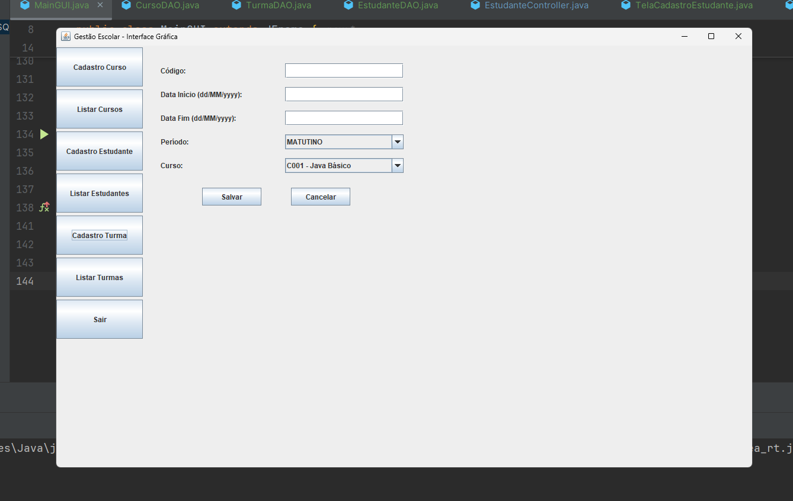
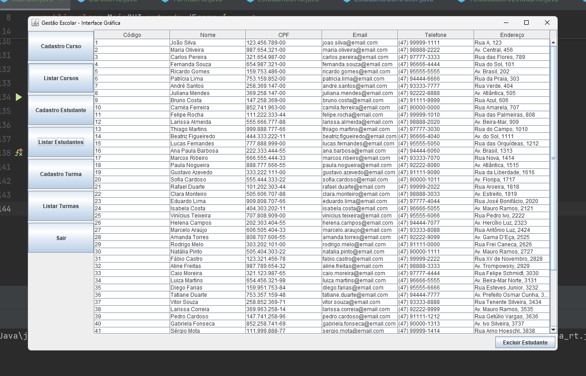

# 🎓 Sistema de Gestão de Cursos - Java + PostgreSQL

## 📌 Descrição do Projeto

O **Sistema de Gestão de Cursos** é uma aplicação desenvolvida em **Java** com interface gráfica **Swing**, persistência de dados em **PostgreSQL** e arquitetura organizada seguindo boas práticas de **MVC (Model-View-Controller)**.

O sistema permite:

* Cadastro e listagem de **Cursos**
* Cadastro e listagem de **Estudantes**
* Cadastro e listagem de **Turmas**
* Exclusão de registros diretamente pela interface
* Uso de **enums** para campos como `Nível` e `Período` integrados ao PostgreSQL
* Captura do **código gerado** para novos estudantes diretamente no momento da inserção

O projeto foi desenvolvido seguindo a **Metodologia Ágil (Scrum)**, com divisão em **20 Sprints** e participação de **três desenvolvedores** com funções definidas:

* **Pedro Paulo** → Líder técnico e responsável pelo back-end e integração com banco de dados
* **Carla Souza** → Desenvolvedora front-end, responsável pelas interfaces gráficas
* **Lucas Andrade** → Analista de banco de dados e responsável pela modelagem e manutenção das tabelas

---

## 🛠 Tecnologias Utilizadas

### **Front-end**

* Java Swing (Interface gráfica)

### **Back-end**

* Java 17+
* JDBC (Java Database Connectivity)

### **Banco de Dados**

* PostgreSQL 15+
* Enums nativos para campos `nivel_enum` e `periodo_enum`

---

## 📅 Planejamento Ágil - Sprints

| Sprint | Descrição                                                     | Desenvolvedor(es)          | Período Desenvolvimento | Testes | Revisão | Deploy | Observações                        |
| ------ | ------------------------------------------------------------- | -------------------------- | ----------------------- | ------ | ------- | ------ | ---------------------------------- |
| 1      | Configuração do ambiente Java e PostgreSQL                    | Pedro Paulo, Lucas Andrade | 01/07/2025              | 1 dia  | 1 dia   | 1 dia  | Banco configurado com schemas      |
| 2      | Criação do banco e tabelas (`curso`, `estudante`, `turma`)    | Lucas Andrade              | 02/07/2025              | 1 dia  | 1 dia   | 1 dia  | Uso de enums no Postgres           |
| 3      | Implementação da conexão com o PostgreSQL (`ConexaoPostgres`) | Pedro Paulo                | 03/07/2025              | 1 dia  | 1 dia   | 1 dia  | Teste de conexão realizado         |
| 4      | Modelagem das entidades (`Curso`, `Estudante`, `Turma`)       | Pedro Paulo                | 04/07/2025              | 1 dia  | 1 dia   | 1 dia  | Uso de enums `Nivel` e `Periodo`   |
| 5      | Implementação do DAO de `Curso`                               | Pedro Paulo                | 05/07/2025              | 1 dia  | 1 dia   | 1 dia  | Persistência em Postgres           |
| 6      | Implementação do DAO de `Estudante`                           | Pedro Paulo                | 06/07/2025              | 1 dia  | 1 dia   | 1 dia  | Chave estrangeira `curso_codigo`   |
| 7      | Implementação do DAO de `Turma`                               | Pedro Paulo                | 07/07/2025              | 1 dia  | 1 dia   | 1 dia  | Persistência com enum `Periodo`    |
| 8      | Interface de cadastro de Cursos (`TelaCadastroCurso`)         | Carla Souza                | 08/07/2025              | 1 dia  | 1 dia   | 1 dia  | Validação de campos                |
| 9      | Interface de cadastro de Estudantes (`TelaCadastroEstudante`) | Carla Souza                | 09/07/2025              | 1 dia  | 1 dia   | 1 dia  | Código gerado automaticamente      |
| 10     | Interface de cadastro de Turmas (`TelaCadastroTurma`)         | Carla Souza                | 10/07/2025              | 1 dia  | 1 dia   | 1 dia  | Uso de comboBox para cursos        |
| 11     | Interface de listagem de Cursos (`TelaListarCursos`)          | Carla Souza                | 11/07/2025              | 1 dia  | 1 dia   | 1 dia  | Ordenação por código               |
| 12     | Interface de listagem de Estudantes (`TelaListarEstudantes`)  | Carla Souza                | 12/07/2025              | 1 dia  | 1 dia   | 1 dia  | Exclusão por código                |
| 13     | Interface de listagem de Turmas (`TelaListarTurmas`)          | Carla Souza                | 13/07/2025              | 1 dia  | 1 dia   | 1 dia  | Inclusão de informações do curso   |
| 14     | Tratamento de enums no banco (`nivel_enum`, `periodo_enum`)   | Pedro Paulo, Lucas Andrade | 14/07/2025              | 1 dia  | 1 dia   | 1 dia  | Uso de `.name()` e `::enum` no SQL |
| 15     | Ajuste para retorno de IDs e uso de `RETURNING` no SQL        | Pedro Paulo                | 15/07/2025              | 1 dia  | 1 dia   | 1 dia  | Necessário para capturar PK gerada |
| 16     | Ajuste na exclusão para uso de `codigo` no lugar de CPF       | Pedro Paulo                | 16/07/2025              | 1 dia  | 1 dia   | 1 dia  | Correção de bug de chave primária  |
| 17     | Testes integrados de todas as funcionalidades                 | Pedro Paulo, Carla Souza   | 17/07/2025              | 1 dia  | 1 dia   | 1 dia  | OK                                 |
| 18     | Documentação do projeto                                       | Pedro Paulo                | 18/07/2025              | 1 dia  | 1 dia   | 1 dia  | Incluindo README                   |
| 19     | Otimização e melhorias finais                                 | Pedro Paulo, Carla Souza   | 19/07/2025              | 1 dia  | 1 dia   | 1 dia  | Ajustes de código                  |
| 20     | Apresentação final do sistema                                 | Toda a equipe              | 20/07/2025              | 1 dia  | 1 dia   | 1 dia  | Projeto pronto                     |

---

## 📄 Partes mais complexas do código

### **1. Inserção de Curso com Enum PostgreSQL**

```java
public void inserir(Curso curso) {
    String sql = "INSERT INTO curso (codigo, nome, carga_horaria, nivel) VALUES (?, ?, ?, ?::nivel_enum)";
    try (Connection conn = ConexaoPostgres.getConnection();
         PreparedStatement stmt = conn.prepareStatement(sql)) {
        stmt.setString(1, curso.getCodigo());
        stmt.setString(2, curso.getNome());
        stmt.setInt(3, curso.getCargaHoraria());
        stmt.setString(4, curso.getNivel().name()); // Enum em formato compatível
        stmt.executeUpdate();
    } catch (SQLException e) {
        throw new RuntimeException("Erro ao inserir curso no PostgreSQL: " + e.getMessage(), e);
    }
}
```

💡 **Importância:** Necessário uso de `::nivel_enum` para conversão explícita no PostgreSQL.

---

### **2. Inserção de Turma com Enum PostgreSQL**

```java
public void inserir(Turma turma) {
    String sql = "INSERT INTO turma (codigo, data_inicio, data_fim, periodo, curso_codigo) VALUES (?, ?, ?, ?::periodo_enum, ?)";
    try (Connection conn = ConexaoPostgres.getConnection();
         PreparedStatement stmt = conn.prepareStatement(sql)) {
        stmt.setString(1, turma.getCodigo());
        stmt.setDate(2, Date.valueOf(turma.getDataInicio()));
        stmt.setDate(3, Date.valueOf(turma.getDataFim()));
        stmt.setString(4, turma.getPeriodo().name());
        stmt.setString(5, turma.getCurso().getCodigo());
        stmt.executeUpdate();
    } catch (SQLException e) {
        throw new RuntimeException("Erro ao inserir turma: " + e.getMessage(), e);
    }
}
```

💡 **Importância:** Assim como no curso, exige `::periodo_enum` para compatibilidade.

---

### **3. Inserção de Estudante com Captura de Código Automático**

```java
public void inserir(Estudante estudante) {
    String sql = "INSERT INTO estudante (nome, cpf, email, telefone, endereco, curso_codigo) VALUES (?, ?, ?, ?, ?, ?) RETURNING codigo";
    try (Connection conn = ConexaoPostgres.getConnection();
         PreparedStatement stmt = conn.prepareStatement(sql)) {
        stmt.setString(1, estudante.getNome());
        stmt.setString(2, estudante.getCpf());
        stmt.setString(3, estudante.getEmail());
        stmt.setString(4, estudante.getTelefone());
        stmt.setString(5, estudante.getEndereco());
        stmt.setString(6, estudante.getCurso().getCodigo());
        try (ResultSet rs = stmt.executeQuery()) {
            if (rs.next()) {
                estudante.setCodigo(rs.getInt("codigo"));
            } else {
                throw new SQLException("Falha ao obter o código do estudante inserido.");
            }
        }
    } catch (SQLException e) {
        throw new RuntimeException("Erro ao inserir estudante: " + e.getMessage(), e);
    }
}
```

💡 **Importância:** `RETURNING codigo` foi essencial para capturar automaticamente a PK gerada no momento da inserção.

## 🖼 Capturas de Tela da Interface

📌 **1. Cadastro de Curso com Enum**  


📌 **2. Cadastro de Turma com Enum**  


📌 **3. Lista de Estudantes com Curso Vinculado**  



## 📊 Vantagens e dificuldades da Metodologia Ágil

**Vantagens**

* Entregas rápidas e incrementais
* Feedback constante e adaptação às mudanças
* Melhor comunicação entre membros da equipe
* Mais fácil de identificar e corrigir erros cedo

**Dificuldades**

* Exige disciplina e comprometimento com prazos
* Necessário bom entendimento das tarefas para evitar retrabalho
* Para equipes pequenas, algumas cerimônias podem ser sobrecarregantes
* Integração contínua requer atenção constante a testes

---

## 👤 Autor

**Pedro Paulo Damasceno Muniz**
Estudante de Análise e Desenvolvimento de Sistemas – Uniasselvi – Blumenau
Participante do treinamento intensivo +Devs2Blu – Blumenau
GitHub: [https://github.com/Damasceno11](https://github.com/Damasceno11)


